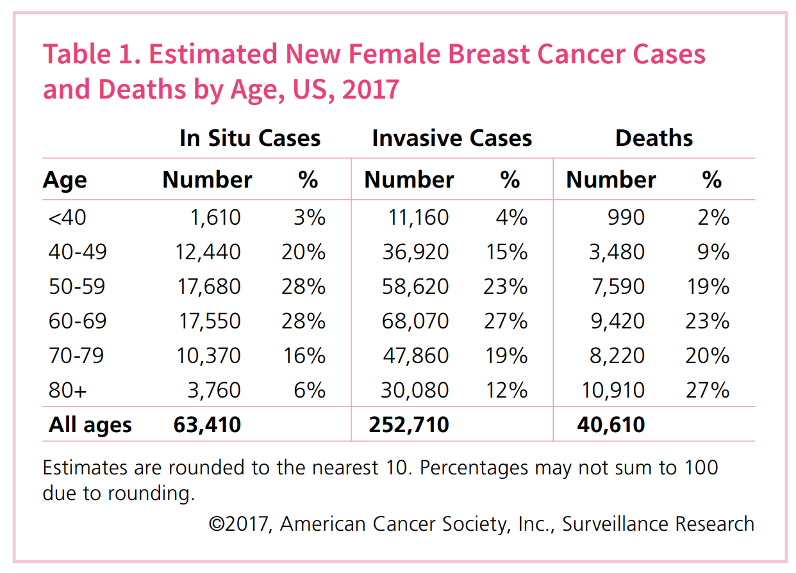

# *Whether benign or malignant? Time to automatically predict the cancer!*  
  
### **Overview and Motivation**  
#### Project overview  
Breast cancer is one of the most prevalent types of cancer today in women and the death rate is nearly 20% across different ages. One in eight women in the United States will be diagnosed with breast cancer in her lifetime^[1]^. The current diagnosis method is through manual examination of histopathology tissue slides, which is subjective and error-ridden^[2]^.  
```{r,fig.width=4,fig.height=5,fig.align='center',echo=FALSE}

```

In this study, we use a public breast cancer datasets available on UCL Machine Learning Repository and establish six different classifiers using machine learning and data mining techniques (like KNN, LDA, random forest, SVM with radial kernel, Neural Network and GBM) to help doctors diagnose the cancer (benign or malignant) quickly and precisely. Since the proportion of malignant cases is rare, we use SMOTE algorithm to deal with unbalanced classification problems.  
  
After data cleaning, we use PCA for features extraction since many features are highly correlated. Then we choose the first 10 PCs (95.16% total variance explain) as input features, original unbalanced training dataset and new training dataset for our model building. And we test models?? performance on the validation set. We found that all classifiers we build achieve decent overall accuracy. Based on the highest AUC (0.9781) and sensitivity (0.9649) scores, we choose Gradient Boosting Machine generated by new training data as our final model. And we also found that SMOTE algorithms could improve both accuracy and sensitivity of detecting the malignant cases in some cases. Based on the results, we discuss some merits, concerns, and bias/fairness of our final model. Finally, we give some recommendations for implement our model in the real life, which has important practical value.  

#### Motivation  
Our main motivation is to explore public breast cancer datasets containing cell dimension features and build classifiers with machine learning and data mining techniques to help doctors diagnose the cancer (benign or malignant) quickly and precisely. Since the dataset we use has unbalanced classes proportion, our second motivation is to use some algorithms to deal with the unbalanced classification problem.  
  
### **Related work**    
This semester I also took the Data Mining course at MIT, which inspired me to combine what I learned in those two courses to solve a real life problem in health care.  
Some related works have been done these years^[3-4]^, however, they haven??t taken the influence of imbalanced data issue into account when they build classifiers. It??s common that breast cancer could be rare outcome when we use cross-sectional sampling scheme. In that case, a model they choose might have high overall accuracy but relatively low sensitivity to detect the malignant cases, which people care more about in the real life.  

### **Initial questions**    
The initial question we try to answer is to predict the breast cancer type (M = malignant, B = benign).  
$$\Downarrow $$
This is a classification probelm for two classes. And since the data is unbalanced, our goal is try to slove this unbalanced classification question.  
$$\Downarrow $$
For the data set we use, it contains ten features are computed for each cell nucleus. Therefore, our question evolves to "how to use these features to build classifiers to classify each observation.  
$$\Downarrow $$
However, since many features are highly correlated, we use PCA for features extraction. Then our question evolves to "how to build classifiers with those PC we choose".  
$$\Downarrow $$
In the end, we want to give some recommendations for implement our classfication in the real life.  
(Note that new questions come up across the course of our analysis, such as how to deal with unbalanced classes, what should we do if the model is hard to interpret. Details are shown in the result part.)  

### **Data**    
#### Description of dataset  
The dataset is available on the Kaggle website. [Breast Cancer Wisconsin (Diagnostic) Data Set] (https://www.kaggle.com/uciml/breast-cancer-wisconsin-data)  
1.  Dataset names: Breast Cancer Wisconsin (Diagnostic) Data Set  
2.  Number of observations : 569	
3.  Features Information: ID number, Diagnosis (M = malignant, B = benign), Ten features are computed for each cell nucleus: Radius, texture, perimeter, area, smoothness, compactness, concavity, concave points, symmetry, fractal dimension.
(Note that the mean, standard error and "worst" (mean of the three largest values) of these 10 cell dimensional features were all computed for each image, resulting in 30 features. eg. field 4 is mean texture, field 14 is texture SE, field 24 is worst texture. )  
4.  Classes proportion: B: 62.74%  M:37.26%
5.  Date Donated: 11/01/1995  

#### Scraping method  
Since the data.csv is already available on Kaggle website. We directly download and read it without using scrapping.  
```{r,message=FALSE, warning=FALSE}
## load reuire packages
library(tidyverse) # importing, cleaning, visualising
library(corrplot) # correlation visualisation
library(caret) # visualization & modeling 
library(factoextra) #plot the biplot
library(RColorBrewer) # set the color
library(DMwR) # perform SMOTE tech to inbalanmced classes
library(pROC) # obtain the AUC
library(NeuralNetTools) # plot the neural network
library(pander) # shown tables
library(gridExtra) # arrange multiple plots
## read the data
bc.data <- read.csv("data.csv")
```
#### Data cleaning  
The data is already in the tidy format, that is, each row represents one observation and the columns represent the different variables that we have data on for those observations. Therefore, we skip the process of reshaping the data.  
Here we need to check if there is any missing value. We found that: Column ??X?? contains only ??NA??, no any useful information. In this case, we delete this column. After that, there is no missing value in our data to be imputed.    
```{r}
# check the missing value
sum(is.na(bc.data))
bc.data$X <- NULL
```

### **Exploratory Data Analysis & Feature Extraction**    
Firstly, we check the label distribution.  

```{r}
pander(prop.table(table(bc.data$diagnosis)),
       caption= "Porportion of two classes")
```

It is clear that the proportions of two different classes is different in this case. Therefore, it could be a unbalanced classification problem.  

Secondly, we use feature plots to summarize the distribution of two classes in different features. We could see that there is no feature could separate those two classes very well.
```{r,fig.width=5,fig.height=10,fig.align='center'}
scales <- list(x=list(relation="free"),y=list(relation="free"))
featurePlot(x=subset(bc.data,select = -c(id,diagnosis)), 
            y=bc.data$diagnosis, 
            plot="density",
            scales=scales,
            layout = c(3,10),
            auto.key = list(columns = 2), 
            pch = "|")
```
Thirdly, we use the corrplot to check the correlations between variables.  
```{r,fig.width=6,fig.height=6,fig.align='center'}
corr_matrix <- cor(subset(bc.data,select = -c(id,diagnosis)))
corrplot(corr_matrix, order = "hclust", tl.cex = 1, addrect = 8,
         col = brewer.pal(n = 8, name = "RdBu"))
```
We could see that many features are highly correlated, which will cause ??multicollinearity?? between variables. This makes sense because some indices of cell dimensions are correlated. Furthermore, the mean, standard error and worst result of these values are inherently correlated.  

Therefore, we choose to perform PCA on those 30 variables for feature extraction. __Advantages: (1) Decrease variance by sacrificing a small increase of bias and won the variance-bias trade off. (2) Decrease the computational throughput. 3. Make interpretation more easily.__  
In PCA, we standardize our data to avoid distortion caused by difference scales. Based on the PC results, we found that the first two PCs explain the 63.24% of the total joint variance in our dataset. And we need the first 10 PCs to explain over 95% (95.16%) of the total variance. We could also see the scree plot as shown below. In this case, we will choose the first ten PCs for our model building.  
```{r,fig.width=5,fig.height=5,fig.align='center'}
bc.pca <- prcomp(bc.data[,3:ncol(bc.data)], center = TRUE, scale = TRUE)
plot(bc.pca, type="l",main = "Scree plot of PCA")
```
For better visualization of different PCs, we plot coordinates for each variable in different PCs. It is clear to see that after the first 10 PCs, the coordinates for each variable becomes zero and those PCs contain very small information, which validates our choice to only pick up the first 10 PCs.  
```{r,fig.width=6,fig.height=6,fig.align='center'}
# We obatin the PCA variables
bc.pca.var <- get_pca_var(bc.pca)
corrplot(bc.pca.var$coord, is.corr=FALSE,
         col = brewer.pal(n = 8, name = "RdBu"))
```
We could also plot the contribution for each variable in different PCs to see which variables is dominated in each PC. It turns out that variables are basically equally contributed to the first 10 PCs.  
```{r,fig.width=6,fig.height=6,fig.align='center'}
corrplot(bc.pca.var$contrib, is.corr=FALSE,
         col = brewer.pal(n = 8, name = "RdBu"))
```
In the end, it could be very helpful to map the data points and variables along the first two PCs, which we often called biplot of PCA^[7]^. In our project, we plot the biplot for all variables, and also for the ??mean??, ??se??, and ??worst?? set of variables.  
```{r,fig.width=10,fig.height=10,fig.align='center'}
# plot the biplot
p1 <- fviz_pca_biplot(bc.pca, col.ind = bc.data$diagnosis, col="black",
                palette = c("#E7B800", "#FC4E07"), geom = "point", repel=TRUE,
                legend.title="Diagnosis", addEllipses = TRUE, ellipse.level=0.95,
                title = "PCA Biplot for all 30 features")
# We also want to visualize the results on different sets of features
# mean
bc.pca.mean <- prcomp(bc.data[,3:12], center = TRUE, scale = TRUE)
# plot the biplot
p2 <- fviz_pca_biplot(bc.pca.mean, col.ind = bc.data$diagnosis, col="black",
                palette = "Set1", geom = "point", repel=TRUE,
                legend.title="Diagnosis", addEllipses = TRUE, ellipse.level=0.95,
                title = "PCA Biplot for 10 mean related features")
# se
bc.pca.se <- prcomp(bc.data[,13:22], center = TRUE, scale = TRUE)
# plot the biplot
p3 <- fviz_pca_biplot(bc.pca.se, col.ind = bc.data$diagnosis, col="black",
                palette = "Set1", geom = "point", repel=TRUE,
                legend.title="Diagnosis", addEllipses = TRUE, ellipse.level=0.95,
                title = "PCA Biplot for 10 se related features")
# worst
bc.pca.worst <- prcomp(bc.data[,23:32], center = TRUE, scale = TRUE)
# plot the biplot
p4 <- fviz_pca_biplot(bc.pca.worst, col.ind = bc.data$diagnosis, col="black",
                palette = "Set1", geom = "point", repel=TRUE,
                legend.title="Diagnosis", addEllipses = TRUE, ellipse.level=0.95,
                title = "PCA Biplot for 10 se related features")
grid.arrange(p1, p2, p3, p4, ncol=2)
```
We found that some variables are clustered in the second quadrant, most of the others are clustered in the third quadrant. We could further look at these cluster if we want to do deeper analysis to analyze the correlations.   

### **Final Analysis**    
#### **Model building**
##### Data partition and SMOTE  

In our study, we partition the dataset into two different parts: 70% as training set, 30% as validation set. The training set is used to build classifiers with 10 fold cross validation for tuning the hyperparameters. And test their performance on the validation set.  
For the cross validation and test metric, rather than just naively look at the overall accuracy, **AUC** (area under the ROC curves) take the true positive rate, false positive rate, true negative rate and false negative rate into account, which could give us a more fairly accurate picture. Therefore, we use the AUC to be our metric.  
After data partitioning, we use SMOTE to create positive observations in the training set. We set perc.over=100 to double the quantity of malignant cases, and set perc.under=200 to keep half of what was created as benign cases. Now, the proportion of two classes in the new training set are 50% B and 50% M.  
```{r}
# partition the dataset (70% as training set, 30% as validation set)
set.seed(222)
# we remove the id column
bc.data <- subset(bc.data,select = -id)
train <- sample(seq(nrow(bc.data)),
                floor(nrow(bc.data) * 0.7))
train <- sort(train)
valid <- which(!(seq(nrow(bc.data)) %in% train))
train.df <- bc.data[train,]
valid.df <- bc.data[valid,]

# Here we use SMOTE technique to obtain a more balanced training set
train.df.new <- SMOTE(diagnosis ~ ., train.df, 
                      perc.over = 100, perc.under = 200)
# Control the computational nuances of the train function
trControl <- trainControl(method="cv",
                           number = 10,
                           preProcOptions = list(thresh = 0.95), 
                           classProbs = TRUE,
                           summaryFunction = twoClassSummary)
pander(table(train.df.new$diagnosis),
       caption= "Porportion of two classes in the new training set")
```

##### Normalization    

Generally, models that evaluate the distances or similarities between data points, like SVM and KNN, are sensitive to normalization. Even though tree-based ensemble methods, like Random Forest, XGB are less sensitive, but still be a good idea to standardize the data. And models could be more comparable after standardization.  
Therefore, in this case, we normalization our features using the following formula:  
$$Z=\frac{X-\mu}{\sigma}$$
which $\mu$ is the sample mean and $\sigma$ is the sample standard deviation.  

##### KNN classifiers  
__To be able to compare the performance, we use both original unbalanced training set and new balanced training set to train our model and compare their performance.__  
Parameter tuning results are shown as below:  
```{r,fig.width=10,fig.height=5,fig.align='center'}
knn <- train(diagnosis~.,data = train.df,
             method = "knn",metric = "ROC",
             preProcess=c('center', 'scale', "pca"),
             tuneLength = 10, trControl = trControl)
p1 <- plot(knn, main="Parameter tuning for KNN (original)")

# construct confusion matrix and get AUC
pred_knn <- predict(knn, valid.df)
knn_cm <- confusionMatrix(pred_knn, valid.df$diagnosis,
                positive = "M")
knn_auc <- auc(roc(as.numeric(valid.df$diagnosis), as.numeric(pred_knn)))

# using new training set
knn.new <- train(diagnosis~.,data = train.df.new,
             method = "knn",metric = "ROC",
             preProcess=c('center', 'scale', "pca"),
             tuneLength = 10, trControl = trControl)
p2 <- plot(knn.new, main="Parameter tuning for KNN (new)")
grid.arrange(p1,p2,ncol=2)
pred_knn_new <- predict(knn.new, valid.df)
knn_cm_new <- confusionMatrix(pred_knn_new, valid.df$diagnosis,
                          positive = "M")
knn_auc_new <- auc(roc(as.numeric(valid.df$diagnosis), as.numeric(pred_knn_new)))
```
And the results of classifiers are:  
```{r}
knn$finalModel
knn.new$finalModel
```
##### Random forest classifiers  
Parameter tuning results are shown as below:  
```{r,fig.width=10,fig.height=5,fig.align='center'}
rf <- train(diagnosis ~., data = train.df,
            method = "rf", metric = 'ROC', 
            preProcess=c('center', 'scale', 'pca'),
            tuneGrid = expand.grid(mtry = c(2,3,4,5)), 
            trControl = trControl)
p1 <- plot(rf, main="Parameter tuning for random forest (original)")

# construct confusion matrix and get AUC
pred_rf <- predict(rf, valid.df)
rf_cm <- confusionMatrix(pred_rf, valid.df$diagnosis,
                positive = "M")
rf_auc <- auc(roc(as.numeric(valid.df$diagnosis), as.numeric(pred_rf)))

# using the banlanced dataset
rf.new <- train(diagnosis ~., data = train.df.new,
            method = "rf", metric = 'ROC', 
            preProcess=c('center', 'scale', 'pca'),
            tuneGrid = expand.grid(mtry = c(2,3,4,5)), 
            trControl = trControl)
pred_rf_new <- predict(rf.new, valid.df)
rf_cm_new <- confusionMatrix(pred_rf_new, valid.df$diagnosis,
                         positive = "M")
rf_auc_new <- auc(roc(as.numeric(valid.df$diagnosis), as.numeric(pred_rf_new)))
p2 <- plot(rf.new, main="Parameter tuning for random forest (new)")
grid.arrange(p1,p2,ncol=2)
```
The variable importance is shown as below. It is obvious because we use the first PCs (decreasingly explain the total variance) to be the input variable of RF.  
```{r,fig.width=10,fig.height=5,fig.align='center'}
# plot the variance importance
p1 <- plot(varImp(rf.new), top = 10, main = "Variable importance (original)")
p2 <- plot(varImp(rf), top = 10, main = "Variable importance (new)")
grid.arrange(p1,p2,ncol=2)
```
And the results of classifiers are:  
```{r}
rf$finalModel
rf.new$finalModel
```
##### LDA classifiers 
We could get two different sets of coefficients of the linear discriminant function:  
```{r}
lda <- train(diagnosis ~., data = train.df,
            method = "lda", metric = 'ROC', 
            preProcess=c('center', 'scale', 'pca'),
            trControl = trControl)
# see the results
pred_lda <- predict(lda, valid.df)
lda_cm <- confusionMatrix(pred_lda, valid.df$diagnosis,
                positive = "M")
lda_auc <- auc(roc(as.numeric(valid.df$diagnosis), as.numeric(pred_lda)))

# use new training set
lda.new <- train(diagnosis ~., data = train.df.new,
             method = "lda", metric = 'ROC', 
             preProcess=c('center', 'scale', 'pca'),
             trControl = trControl)
# see the results
pred_lda_new <- predict(lda.new, valid.df)
lda_cm_new <- confusionMatrix(pred_lda_new, valid.df$diagnosis,
                          positive = "M")
lda_auc_new <- auc(roc(as.numeric(valid.df$diagnosis), as.numeric(pred_lda_new)))
a <- lda$finalModel$scaling
colnames(a) <- "coefficients of original training data"
a
b <- lda.new$finalModel$scaling
colnames(b) <- "coefficients of new training data"
b
```
##### SVM classifiers 
Here we use the Radial Kernel, and parameter tuning results are shown as below:  
```{r,fig.width=10,fig.height=5,fig.align='center'}
svm <- train(diagnosis ~., data = train.df, method = "svmRadial", 
             metric = "ROC", 
             preProcess = c('center', 'scale',"pca"), 
             tuneLength = 10,
             trControl = trControl)
p1 <- plot(svm,main="Parameter tuning for svm (original)")
# see the results
pred_svm <- predict(svm, valid.df)
svm_cm <- confusionMatrix(pred_svm, valid.df$diagnosis,
                positive = "M")
svm_auc <- auc(roc(as.numeric(valid.df$diagnosis), as.numeric(pred_svm)))

# use new training set
svm.new <- train(diagnosis ~., data = train.df.new, method = "svmRadial", 
             metric = "ROC", 
             preProcess = c('center', 'scale',"pca"), 
             tuneLength = 10,
             trControl = trControl)
p2 <- plot(svm.new,main="Parameter tuning for svm (new)")
# see the results
pred_svm_new <- predict(svm.new, valid.df)
svm_cm_new <- confusionMatrix(pred_svm_new, valid.df$diagnosis,
                          positive = "M")
svm_auc_new <- auc(roc(as.numeric(valid.df$diagnosis), as.numeric(pred_svm_new)))
grid.arrange(p1,p2,ncol=2)
```
And the results of classifiers are:  
```{r}
svm$finalModel
svm.new$finalModel
```
##### Neural Network classifiers 
Parameter tuning results are shown as below:  
```{r,fig.width=12,fig.height=15,fig.align='center'}
nn <- train(diagnosis ~., data = train.df, method = "nnet", 
             metric = "ROC", 
             preProcess = c('center', 'scale',"pca"), 
             tuneLength = 10,trace=FALSE,
             trControl = trControl)
p1 <- plot(nn, main="Parameter tuning for svm (original)")
# see the results
pred_nn <- predict(nn, valid.df)
nn_cm <- confusionMatrix(pred_nn, valid.df$diagnosis,
                positive = "M")
nn_auc <- auc(roc(as.numeric(valid.df$diagnosis), as.numeric(pred_nn)))

# use new training set
nn.new <- train(diagnosis ~., data = train.df.new, method = "nnet", 
            metric = "ROC", 
            preProcess = c('center', 'scale',"pca"), 
            tuneLength = 10,trace=FALSE,
            trControl = trControl)
p2 <- plot(nn.new, main="Parameter tuning for svm (new)")
# see the results
pred_nn_new <- predict(nn.new, valid.df)
nn_cm_new <- confusionMatrix(pred_nn_new, valid.df$diagnosis,
                         positive = "M")
nn_auc_new <- auc(roc(as.numeric(valid.df$diagnosis), as.numeric(pred_nn_new)))
grid.arrange(p1,p2,ncol=1)
```
And the results of classifiers are:  
```{r}
nn$finalModel
nn.new$finalModel
```
For interpretation, we plot the network structure are shown below: (The upper one is generated by the original training data, the lower one is for the new balanced training data.)  
```{r,fig.width=9,fig.height=4,fig.align='center'}
plotnet(nn$finalModel, alpha = 0.6)
```
```{r,fig.width=9,fig.height=4,fig.align='center'}
plotnet(nn.new$finalModel, alpha = 0.6)
```
We found that the NN generated by the original training data has only one hidden node, which will provide less information than the more the lower one with more hidden nodes.  
  
##### GBM classifiers  
Parameter tuning results are shown as below:   
```{r,fig.width=12,fig.height=15,fig.align='center'}
gbm <- train(diagnosis ~., data = train.df, method = "gbm", 
            metric = "ROC", 
            preProcess = c('center', 'scale',"pca"), 
            tuneLength = 10,verbose = FALSE,
            trControl = trControl)
trellis.par.set(caretTheme())
p1 <- plot(gbm) 
# see the results
pred_gbm <- predict(gbm, valid.df)
gbm_cm <- confusionMatrix(pred_gbm, valid.df$diagnosis,
                positive = "M")
gbm_auc <- auc(roc(as.numeric(valid.df$diagnosis), as.numeric(pred_gbm)))

# use the new training set
gbm.new <- train(diagnosis ~., data = train.df.new, method = "gbm", 
             metric = "ROC", 
             preProcess = c('center', 'scale',"pca"), 
             tuneLength = 10,verbose = FALSE,
             trControl = trControl)

trellis.par.set(caretTheme())
p2 <- plot(gbm.new) 
# see the results
pred_gbm_new <- predict(gbm.new, valid.df)
gbm_cm_new <- confusionMatrix(pred_gbm_new, valid.df$diagnosis,
                          positive = "M")
gbm_auc_new <- auc(roc(as.numeric(valid.df$diagnosis), as.numeric(pred_gbm_new)))
grid.arrange(p1,p2,ncol=1)
```
And the results of classifiers are:  
```{r}
gbm$finalModel
gbm.new$finalModel
```
#### **Model performance comparison**  
##### AUC comparison  
Finally, we want to select a model which has the highest AUC (a highest overall accuracy consider the true positive rate, false positive rate, true negative rate and false negative rate) on the validation dataset. Because we often underestimate the error rate if we only consider the training dataset, here we use validation set to evaluate the performances of different models building by both the unbalanced training set and new balanced training set generated by SMOTE. Results are shown as below:  
```{r,fig.width=6,fig.height=5,fig.align='center'}
# compare the AUC for different models
AUC <- c(knn_auc,knn_auc_new,rf_auc,rf_auc_new,
        lda_auc,lda_auc_new,svm_auc,svm_auc_new,
        nn_auc,nn_auc_new,gbm_auc,gbm_auc_new)
group <- c("original","new","original","new","original","new","original","new",
       "original","new","original","new")
classifiers <- c("KNN","KNN","RF","RF","LDA","LDA",
                "SVM","SVM","NN","NN","GBM","GBM")
df <- data.frame(AUC,group,classifiers)
df$group <- as.factor(df$group)
df$classifiers <- as.factor(df$classifiers)
df$group <- factor(df$group,levels = c("original","new"))
# plot the results
df %>%
  ggplot(aes(x=classifiers,y=AUC,fill=group))+
  geom_bar(stat="identity", position=position_dodge(),color="black")+
  scale_fill_brewer(palette="Blues")+
  coord_cartesian(ylim = c(0.7,1))+
  ggtitle("Different models' performance on AUC")+
  theme_bw()
```
__**Conclusions drawn from results:**__  
__1.	All classifiers are achieve a decent AUC, which indicated an overall good accuracy.__  
__2.	When we use the new training dataset, some classifiers?? AUC decrease (NN and SVM). This indicates that using SMOTE in those situations may not improve the accuracy. This is because SMOTE perform best in extremely imbalanced cases. If classes are not very rare, in some cases, SMOTE would not give a higher accuracy.__  
__3.	Gradient Boosting Machine basically achieve a highest AUC.__  

##### Sensitivity comparison   
Since in the real life, doctors or patients may more care about the sensitivity (the proportion of actual positives that are correctly identified). That is, they want to detect the true patients of breast cancer more precisely. That is the reason why we use SMOTE and expect the new balanced training set would improve the models?? sensitivity. We output the results and the plot is shown below:  
```{r,fig.width=6,fig.height=5,fig.align='center'}
# sensitivity for new
models <- list(KNN=knn_cm_new, RF=rf_cm_new, LDA=lda_cm_new,
               SVM=svm_cm_new, NN=nn_cm_new, GBM=gbm_cm_new)
cm_list_results_new <- sapply(models, function(x) x$byClass)

# sensitivity for old
models <- list(KNN=knn_cm, RF=rf_cm, LDA=lda_cm,
               SVM=svm_cm, NN=nn_cm, GBM=gbm_cm)
cm_list_results <- sapply(models, function(x) x$byClass)

# compare the sensitivity levels
x <- c(cm_list_results[1,],cm_list_results_new[1,])
y <- as.factor(c("original","original","original","original","original","original",
       "new","new","new","new","new","new"))
sensitivity_df <- data.frame(sensitivity=x,datasets=y,
                    classifiers=c("KNN","RF","LDA","SVM","NN","GBM","KNN",
                                  "RF","LDA","SVM","NN","GBM"))
sensitivity_df$datasets <- factor(sensitivity_df$datasets,
                                  levels = c("original","new"))
sensitivity_df %>%
  ggplot(aes(x=classifiers,y=sensitivity,fill=datasets))+
  geom_bar(stat="identity", position=position_dodge(),color="black")+
  scale_fill_manual(values=c("#999999", "#E69F00"))+
  coord_cartesian(ylim = c(0.7,1))+
  theme_bw()
```
__**Conclusions drawn from results:**__  
__1.	When we use the new balanced training dataset, all classifiers?? sensitivity level at least not decrease and some of classifiers?? sensitivities level improve a lot. SVM and NN??s sensitivity level seems not change when their AUC decrease.__  
__2.	LDA??s sensitivity is lower than 0.90, which tells us that the assumptions of LDA doesn??t hold in our dataset, like Gaussian distribution and linear decision boundary.__  
__3.	GBM achieving the highest AUC (Figure 14) also has the highest sensitivity.__  

### **Conclusion**    
#### **Final model description**  
Based on both AUC and sensitivity level we discuss above, we choose Gradient Boosting Machine generated by new training data as our final model. The parameter is set to n.trees = 250, interaction.depth = 8, shrinkage = 0.1 and n.minobsinnode = 10.  
Our final GBM model is built by 250 iterations, 0.001 shrinkage parameter and 8 max depth of the tree. Since we don??t use the validation set for model building, we use its performance on validation set to expect the out-of-sample model performance. In this case, we have: AUC=0.9780; Overall accuracy: 0.9825 (95% CI: 0.9496, 0.9964); Sensitivity: 0.9649.  
  
#### **Model bias and fairness**  
1.	Since we use SMOTE algorithm, bias between two classes already been taken into account in our final model.  
2.	This dataset is relatively small (569 obs) for ml techniques and outdated (collected in 1995). This will lead to some bias when we use it to predict recent data.  
3.  Since the data was collected cross-sectional and somewhat random, we could expect the model??s prediction should be relatively fairness to different demographics of people. However, we could not conduct such analysis in our study because we lack those related features in our dataset.  


### **Recommendations for implementation**    
For implementing the final model in the breast cancer diagnosis setting, we recommend two ways to help doctors or patients:  
1.	Wrap our GBM model and further build an online tool, like a website, which is convenient for doctors and patients to check their conditions. Once they input their cell-dimensional results of FNA, it will automatically output the result (B or M).  
2.	Since the GBM is somewhat hard to interpret, we could use some better ways to help. We could firstly obtain the variance importance contribution as weight of each index, and then calculate some score to set a threshold of malignant cases, or use Radar Plot for better visualization. Obviously, it could hurt the overall prediction accuracy. So this only serves as an alternative option for quick diagnosis.  

#### **Reference**  
[1]	American Cancer Society. Breast Cancer Facts & Figures 2017-2018. Atlanta: American Cancer Society, Inc. 2017.  
[2]	Chan, Alan, and Jack A. Tuszynski. "Automatic prediction of tumour malignancy in breast cancer with fractal dimension." Royal Society open science 3.12 (2016): 160558.  
[3]	https://www.kaggle.com/mirichoi0218/classification-breast-cancer-or-not-with-15-ml.  
[4]	https://www.kaggle.com/gpreda/breast-cancer-prediction-from-cytopathology-data.  
[5]	https://archive.ics.uci.edu/ml/datasets/Breast+Cancer+Wisconsin+(Diagnostic).  
[6]	Chawla, Nitesh V., et al. "SMOTE: synthetic minority over-sampling technique." Journal of artificial intelligence research 16 (2002): 321-357.  
[7]	fviz_pca: Quick Principal Component Analysis data visualization - R software and data mining:http://www.sthda.com/english/wiki/fviz-pca-quick-principal-component-analysis-data-visualization-r-software-and-data-mining  


